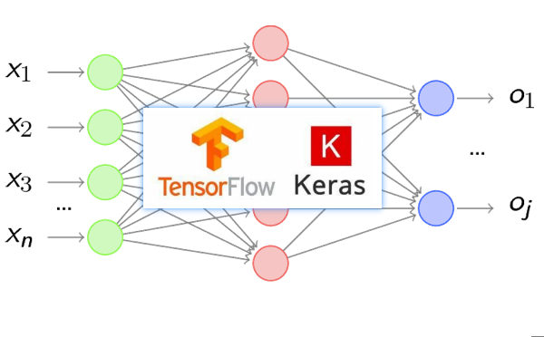
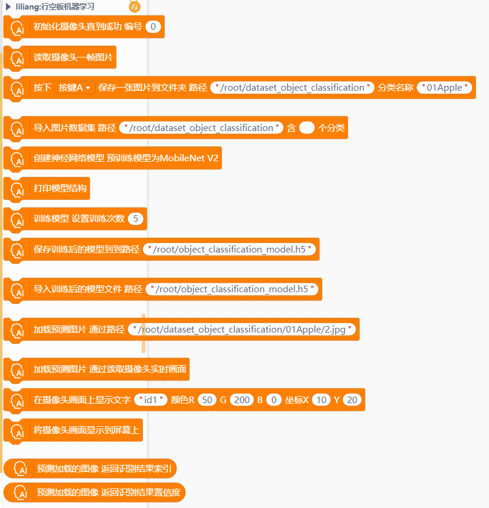

# 行空板机器学习




---------------------------------------------------------

## Table of Contents

* [URL](#url)
* [Summary](#summary)
* [Blocks](#blocks)
* [License](#license)
* [Supported targets](#Supportedtargets)

## URL
* Project URL : ```https://github.com/liliang9693/ext-kerasMLOC```

* Tutorial URL : ```https://mindplus.dfrobot.com.cn/extensions-user```

    


## Summary
使用Mind+V1.7.2及以上版本，在python模式用户库中加载此扩展，在行空板上运行，可实现机器学习训练模型实现物体分类。

## Blocks




## Examples


## License

MIT

## Supported targets

MCU                | JavaScript    | Arduino   | MicroPython    | Python 
------------------ | :----------: | :----------: | :---------: | -----
arduino        |             |              |             | 
micro:bit        |             |              |             | 
esp32        |             |              |             | 
unihiker        |             |              |             | √

## Release Logs

* V0.0.1  基础功能完成

