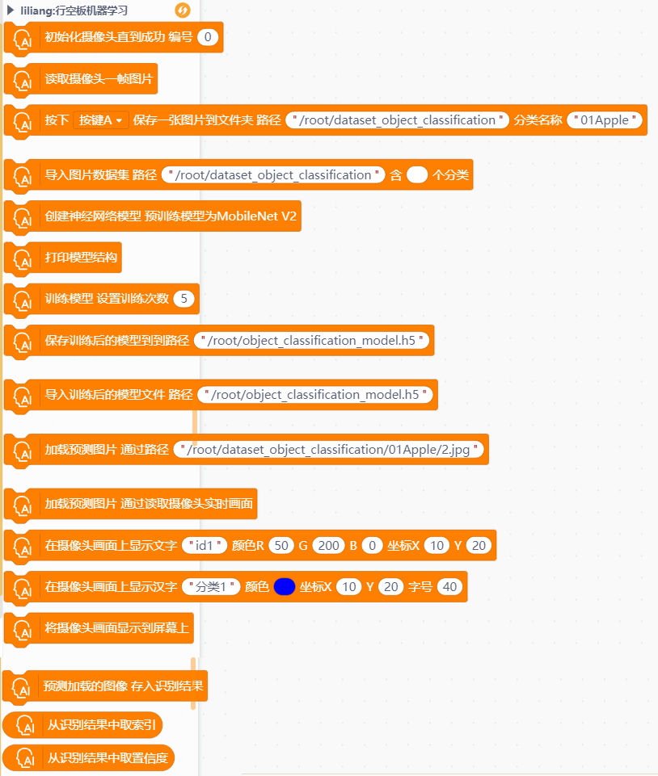
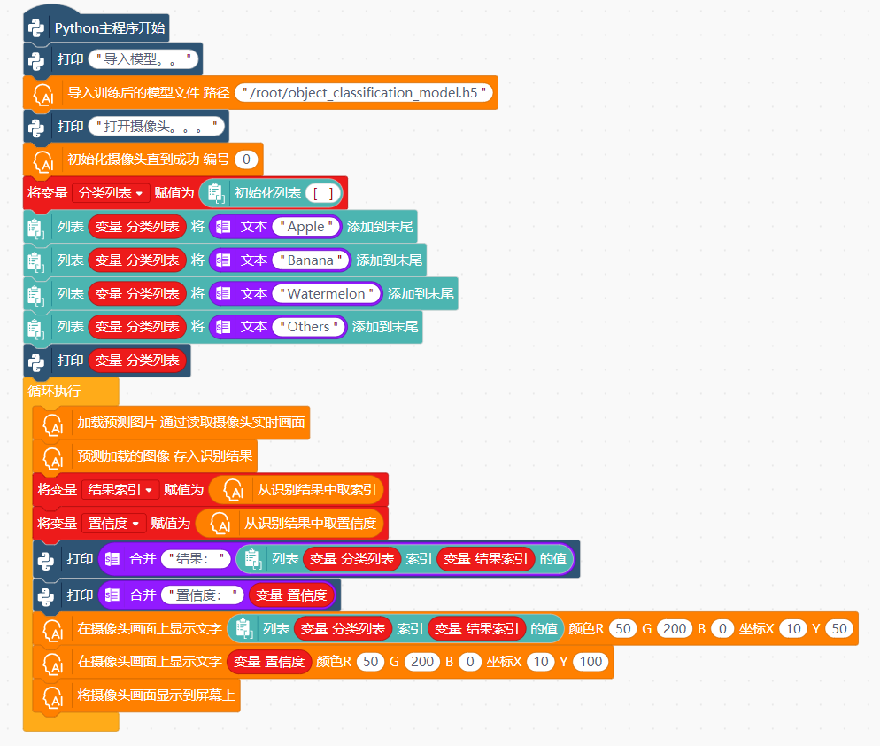

# 行空板机器学习物体分类


---------------------------------------------------------

## Table of Contents

* [URL](#url)
* [Summary](#summary)
* [Blocks](#blocks)
* [License](#license)
* [Supported targets](#Supportedtargets)

## URL
* Project URL : ```https://github.com/liliang9693/ext-kerasMLOC```

* Tutorial URL : ```https://mindplus.dfrobot.com.cn/extensions-user```

    


## Summary
使用Mind+V1.7.2及以上版本，在python模式用户库中加载此扩展，在行空板上运行，可实现机器学习训练模型实现物体分类功能。
参考教程：https://mc.dfrobot.com.cn/thread-314746-1-1.html

## Blocks




## Examples
- 使用opencv从摄像头采集图片数据：

- 导入图片训练模型，产出模型文件：

- 导入模型文件，使用一张图片进行预测：

- 使用opencv视频流进行实时识别：


## License

MIT

## Supported targets

MCU                | JavaScript    | Arduino   | MicroPython    | Python 
------------------ | :----------: | :----------: | :---------: | -----
arduino        |             |              |             | 
micro:bit        |             |              |             | 
esp32        |             |              |             | 
unihiker        |             |              |             | √

## Release Logs

* V0.0.1  基础功能完成
* V0.0.2  简化积木
* V0.0.3  增加opencv采集照片功能，增加实时识别功能，调整积木
